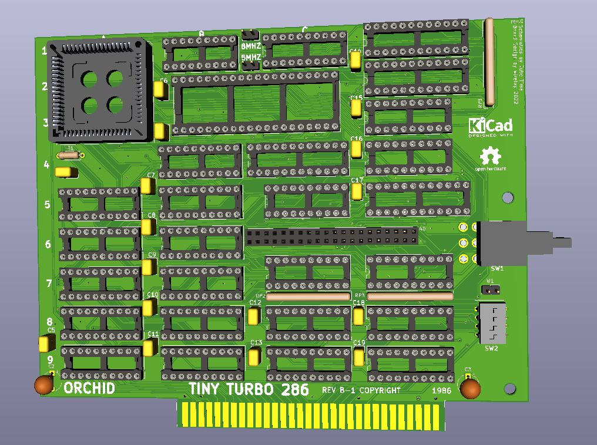

# Orchid Tiny Turbo 286
A clone of the Orchid Tiny Turbo 286 acclerator to upgrade an XT system. Based on schematics by Tube Time.

## Info / Warning
Do not build. This is unconfirmed, and the PAL chip dumps aren't available yet. I do not have the original board, so this is a rough layout, not exactly the same size since it uses socketed footprints. However, it does abide by the ISA standard height (121.92mm), proper ISA slot location, and uses a readily available slot cover that would need to be drilled for the switch to fit through. 
\
\
Built per the schematics from Tube Time's github found here: https://github.com/schlae/tiny-turbo-286
